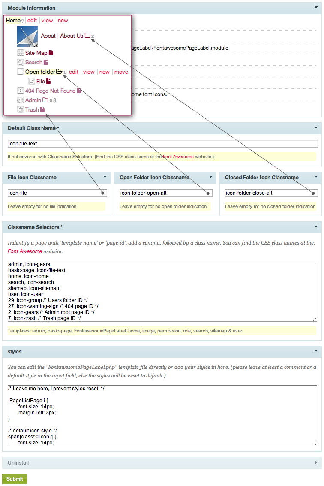

# Font Awesome Page Label

####Yet another PageListLabel module?

* [Font Awesome](http://fontawesome.io/) is really awesome, hundreds of high quality icons, ready to use. (Don't we all know how cool icon fonts are.)
* I wished to use icons in conjunction with the other PageList modules out there.
	(Page List Better Labels, Page List Image Label, Page List Show Page Id & Template Decorator)
* I wanted the possibility to style the icons individually with CSS.
* Showing icons triggered by template name, but can be overruled bij Page ID.
	(Trash Page, 404 Page not found etc.)
* I wanted a better file or folder indication in the PageList tree.

